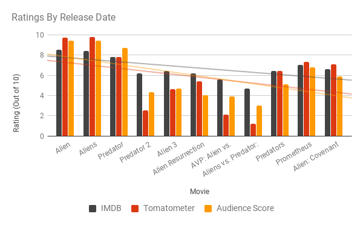
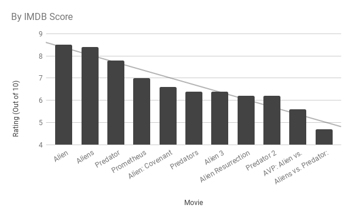
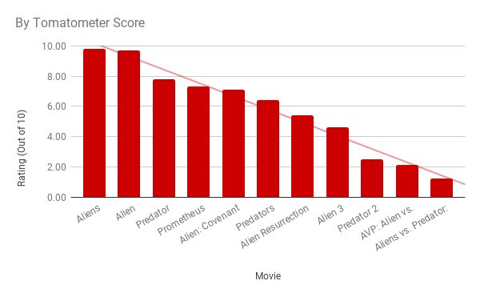
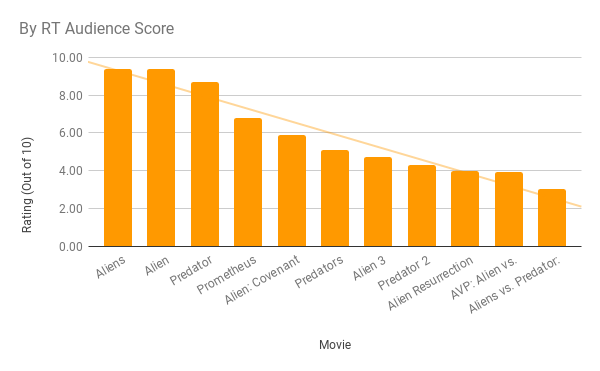
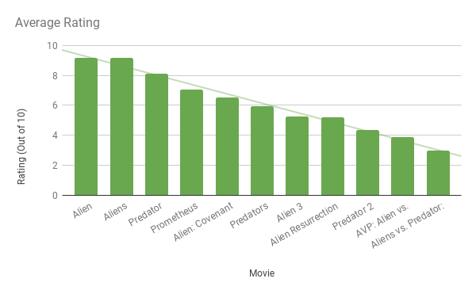
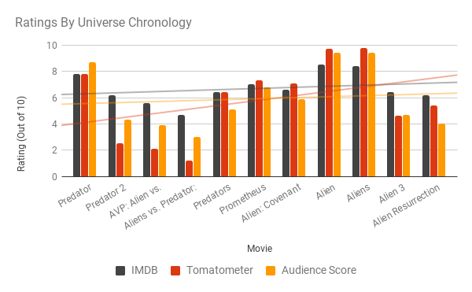

I don't consider myself a movie buff, but I have always been a huge fan of watching movies. The difference to me lies in the extra-curricular activities "buffs" engage in. I think that like anything, you can enjoy doing something a lot, but if you don't take extra time to go above-and-beyond, you're really just a hobbyist.

That said, I do make an effort to see as many movies I can. This is especially true of movies that see frequent reference in pop culture, and doubly for movies that also fall in my favorite genres.

It was then always a black mark on my record that I had not seen any movie in the Alien franchise. I had not, in fact, watched any movie in the Alien _or_ Predator franchises except maybe a friend having Predator on one time I was nearby.

In a gross overreaction to correct this, I now own the Alien franchise box set, the Predator Trilogy, the AVP double-feature, and individual copies of Prometheus and Alien: Covenant on Blu-Ray.

It's taken quite a while to get through them, what with two kids occupying a good portion of my time, and work occupying the rest. As of the writing of this post, I still have Alien: Resurrection and all of the Predator and AVP movies to get through.

All of this pointless setup was leading to this: a consistent theme when discussing the Alien universe is how few of the movies are actually good. (I enjoyed both of the latest offerings more than most seemed to, but that's beside the point.) Most people agree that there are really only a handful of "good" Alien movies.

This got me to thinking, and thinking gets me to graphing. So, with many words of introduction to a stupid concept I spent far too much time on, here are the movies of the Alien universe as defined by their ratings in various forms.

To start, we'll simply see how the movies have fared over time. The following graph is just the movies, in order of release date. (Note: since I compiled all of these by hand, I only bothered to find three scores for comparison. My wife would argue this was three too many, I imagine.)

It's not looking good for ratings all the way around. We will just have to wait and see if 2018's The Predator, or any of the six movies Ridley Scott claims to have ready for Alien pull the series trend back up above level.

To get a slightly more readable picture, as well as to see how the various scores compare to each other, here are the individual ratings in order:

There isn't a whole lot of variability between scores. Notably, it's difficult to determine whether people prefer Alien or Aliens, but suffice it to say, they are the stand-out favorites. Something not shown on the graphs themselves are that, on average, IMDB scores are higher than either of the Rotten Tomatoes offerings. Maybe they're more forgiving.

The next graph is pretty self explanatory.

And look at that. The ratings for Alien and Aliens are identical. No surprise there, I just like mentioning things that are readily apparent.

Finally, the graph I was originally interested in. This is the movies in universe chronological order.

This really doesn't serve much purpose except to say that, in general, people like sci-fi movies about space more than they like sci-fi movies about the jungle. I think that's fair.

That's all. There was no real point to this.
